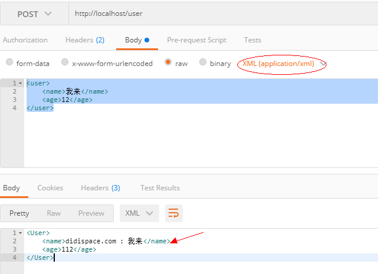

#### JSP + XML

##### 1. JSP Config（访问会默认到index.jsp）
```
spring: 
  mvc:
     view:
        prefix: /WEB-INF/jsp/
        suffix: .jsp
```

##### 2. XML
###### 2.1 java
```
//指定head的Content-Type为：application/xml
    @PostMapping(value = "/user", 
        consumes = MediaType.APPLICATION_XML_VALUE, 
        produces = MediaType.APPLICATION_XML_VALUE)
    @ResponseBody
    public User create(@RequestBody User user) {
        //http://blog.didispace.com/spring-boot-xml-httpmessageconverter/
        user.setName("didispace.com : " + user.getName());
        user.setAge(user.getAge() + 100);
        return user;
    }
```

###### 2.2 
