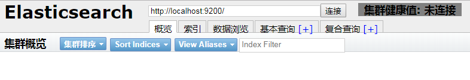

##### 参考文档

#### [Elasticsearch: 权威指南](https://elasticsearch.cn/book/elasticsearch_definitive_guide_2.x/)

##### 1. [全文搜索引擎 Elasticsearch 入门教程](http://www.ruanyifeng.com/blog/2017/08/elasticsearch.html)
##### 2. [ElasticSearch入门 第一篇：Windows下安装ElasticSearch](http://www.cnblogs.com/ljhdo/p/4887557.html)
##### 3. [Elasticsearch及插件安装](https://blog.csdn.net/vbirdbest/article/details/79194244)
##### 4. [安装kibana，X-pack和elasticsearch插件的全过程](https://blog.51cto.com/chenx1242/2045569)
##### 5. [Spring Boot 學習筆記 8 : Elasticsearch](https://www.twblogs.net/a/5b7d58662b71770a43deb838)
##### 6. [Spring Data Elasticsearch学习笔记](https://aceofspades.top/u/ace/blogs/12)

#### Window安装ES环境，可参考[Chocolatey 在Window搭建一个开发环境](https://my.oschina.net/liuzidong/blog/3026912)

##### 1.安装ES环境 > cmder执行命令：cinst elasticsearch，等待安装完成，报错也不管了。

##### 2.进入Elasticsearch安装目录，进入bin 目录，双击执行 elasticsearch.bat，浏览器访问http://localhost:9200/显示成功
 ```
 {
  "name" : "aO8ofeP",
  "cluster_name" : "elasticsearch",
  "cluster_uuid" : "g34QiQEDT0ak1rd0XxczbQ",
  "version" : {
    "number" : "6.7.1",
    "build_flavor" : "default",
    "build_type" : "zip",
    "build_hash" : "2f32220",
    "build_date" : "2019-04-02T15:59:27.961366Z",
    "build_snapshot" : false,
    "lucene_version" : "7.7.0",
    "minimum_wire_compatibility_version" : "5.6.0",
    "minimum_index_compatibility_version" : "5.0.0"
  },
  "tagline" : "You Know, for Search"
}
 ```

##### 3.安装head插件，进入到ElasticSearch的bin目录，使用ES命令安装插件  plugin install mobz/elasticsearch-head，报错：'plugin' 不是内部或外部命令，也不是可运行的程序。查看目录下也存在：elasticsearch-plugin.bat，只好使用 Git 配合 Node.js 的方式來下載和安裝 Elasticsearch-head 插件，特别说明：安装插件位置可以不用在ES目录下哟。
 
##### 3.1 安装Node环境，查看版本：node -v ,nmp -v，[参考示例](https://www.jianshu.com/p/03a76b2e7e00)，可安装常用模板：npm install express -g
##### 3.2 cmder > git clone https://github.com/mobz/elasticsearch-head
##### 3.3 使用命令行進入 head 插件安裝目錄elasticsearch-head，执行：npm install
##### 3.4 安裝成功後，啓動 Elasticsearch-head 插件，执行：npm run start，访问http://localhost:9100/成功 


##### 4. 注册window服务：elasticsearch\bin 执行：elasticsearch-service install，低版本用这个：service.bat install，删除执行：elasticsearch-service remove
  
##### 5. 启动服务： elasticsearch-service start
##### 5.1 管理服务：elasticsearch-service manager
##### 5.2 停止服务：elasticsearch-service stop
##### 5.3 注销服务：elasticsearch-service remove

##### 6. elasticsearch-head插件連接不上es，顯示集羣健康值: 未連接
##### 6.1 解決方法：修改 Elasticsearch 配置文件 config/elasticsearch.yml，添加如下配置：
```
http.port: 9200
http.cors.enabled: true
http.cors.allow-origin: "*"
```
  
##### 6.2 修改 elasticsearch-head 目錄下 Gruntfile.js 文件，找到如下配置，添加：hostname: '0.0.0.0'
```
connect: {
			server: {
				options: {
					hostname: '0.0.0.0',
					port: 9100,
					base: '.',
					keepalive: true
				}
			}
		}
```

##### 6.3 配置cluster与node名称，打开配置：
```
cluster.name: springboot-elasticsearch
node.name: 127.0.0.1:9300
```

##### 6.4 elasticsearch.yml说明，执行如报错，可使用国内的镜像（npm install -g cnpm --registry=https://registry.npm.taobao.org）
```
cluster.name: my-application    #集群标识符
node.name: node-1               #节点标识符
path.data: /path/to/data        #数据存储位置
path.logs: /path/to/logs        #ES的log存储位置
bootstrap.memory_lock: true     #设为true以确保ES拥有足够的JVM内存
network.host: 0.0.0.0          #ES对外服务的IP地址，改填写0.0.0.0
http.cors.enabled: true    #这个是新增
http.cors.allow-origin: "*"    #这个也是新增
```


##### 7. 重新启动elasticsearch服务：elasticsearch.bat > 成功
  
##### 8. 安装bigdesk插件 ，cmder > git clone https://github.com/lukas-vlcek/bigdesk，下载完成后执行：npm install
##### 9. 安装ik分词器 ，cmder > git clone https://github.com/medcl/elasticsearch-analysis-ik ，下载完成后执行：npm install

##### 10. 安装kibana，是一个开源的分析和可视化平台，旨在与 Elasticsearch 合作。Kibana 提供搜索、查看和与存储在 Elasticsearch 索引中的数据进行交互的功能。开发者或运维人员可以轻松地执行高级数据分析，并在各种图表、表格和地图中可视化数据。
###### 10. 1 直接执行：cinst Kibana，也可下载并解压[kibana](https://www.elastic.co/downloads/kibana) 下载的版本必须要和Elasticsearch的版本保持一致
###### 10. 2 配置elasticsearch.url，编辑 kibana目录/conf/kibana.yml 文件中有一个elasticsearch.url被注释掉了，打开elasticsearch.url注释即可
###### 10. 3 启动kibana，切换到kibana\bin目录并启动：kibana.bat
###### 10. 4 访问：http://localhost:5601/

##### 11. 安装x-pack，是elasticsearch的一个扩展包，将安全，警告，监视，图形和报告功能捆绑在一个易于安装的软件包中，[安装步骤说明](https://www.elastic.co/downloads/x-pack)
###### 11.1 ES\bin目录执行：elasticsearch-plugin install x-pack，提示ES6.7的版本默认包含了x-pack，所以不用执行了。
###### 11.2 查看密码：setup-passwords auto，报如下问题
```
Commands
--------
auto - Uses randomly generated passwords
interactive - Uses passwords entered by a user
Non-option arguments:
command
Option         Description
------         -----------
-h, --help     show help
-s, --silent   show minimal output
-v, --verbose  show verbose output
ERROR: Missing command
```
 
###### 11.3 进入kibana\bin目录，执行：kibana-plugin install x-pack
###### 11.3.1 kibana.yml，把“server.host: localhost”改成“server.host: 0.0.0.0”,输入用户名和密码登录，默认分别是 elastic 和 changeme，在这我没有输入哟，可能是配置不对。


